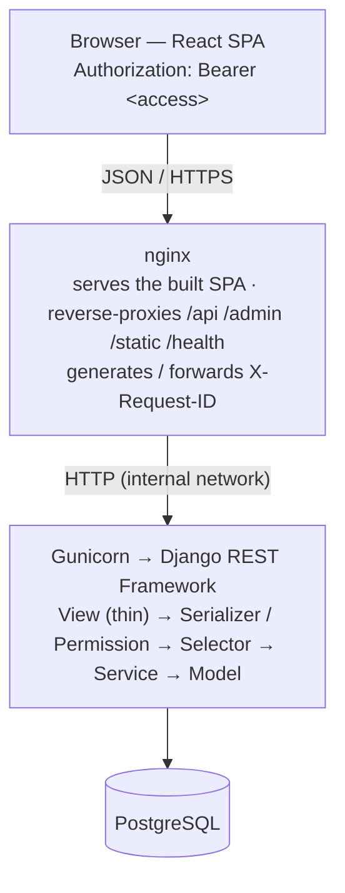

# NEXUS — Multi-Tenant Business Operations SaaS

[](https://github.com/Ing-Makram/Nexus/actions/workflows/ci.yml)
[](./LICENSE)

**NEXUS** is a multi-tenant SaaS application for running the operational side of a
small business: **organizations** with role-based membership, and **customers**,
**orders** and **invoices** scoped strictly to each organization. It ships with a
real production deployment story — containerized stack behind nginx, health and
readiness probes, structured JSON logging with request-ID correlation, optional
Sentry, a CI pipeline, and an end-to-end production smoke test.

It is deliberately **not** a technology showcase. Redis, Celery, an AI engine,
GraphQL and Kubernetes are intentionally out of scope — there is no workload that
justifies them yet, and the codebase says so explicitly (see
[docs/adr/005-future-microservices.md](./docs/adr/005-future-microservices.md)
and [006-design-patterns.md](./docs/adr/006-design-patterns.md)).

---

## 1. Technology Stack

| Layer             | Technology                                                                                                          |
| :---------------- | :------------------------------------------------------------------------------------------------------------------ |
| **Frontend**      | React 19 + TypeScript (strict) + Vite; feature-scoped context/provider architecture, no router, no UI framework     |
| **Backend**       | Python 3.12 + Django 5 + Django REST Framework; `models → selectors → services → permissions → serializers → views` |
| **Auth**          | JWT (`djangorestframework-simplejwt`) with refresh-token blacklist + server-side logout                             |
| **Database**      | PostgreSQL 16 (SQLite for the test suite)                                                                           |
| **Static files**  | WhiteNoise (compressed, hashed manifest)                                                                            |
| **App server**    | Gunicorn (sync workers)                                                                                             |
| **Reverse proxy** | nginx — terminates the SPA, proxies the API, propagates `X-Request-ID`                                              |
| **Containers**    | Docker + Docker Compose (separate dev and prod compose files)                                                       |
| **Observability** | JSON logs to stdout, request/correlation IDs, `/health/` + `/health/ready/`, optional Sentry                        |
| **CI**            | GitHub Actions — backend quality, frontend quality, production config, image builds, full-stack smoke test          |

> The development `docker-compose.yml` also starts Redis + a Celery worker. They
> are provisioned for future background work but carry **no application tasks**
> today and are absent from the production stack.

---

## 2. Architecture



**Principles**

- **The frontend holds no business logic.** It consumes REST endpoints and owns
  only presentation, client state and user feedback.
- **The backend is authoritative** for authentication, authorization, tenant
  isolation, validation and persistence.
- **Layered backend.** `selectors.py` is the only place tenant scoping is
  expressed (`*_for_user`); `services.py` is the only write path (atomic,
  validated); views stay thin.
- **Tenant isolation is structural.** Every query flows through a
  `*_for_user(user)` selector, so a request for another organization's data
  returns **404** — existence is never disclosed.

See the ADRs in [`docs/adr/`](./docs/adr/) for the reasoning behind the modular
monolith, the layered architecture, the multi-tenancy model and the
authentication design.

---

## 3. Features

**Product**

- Email/password auth with sign-up, JWT sessions, transparent refresh, and a
  logout that blacklists the refresh token server-side.
- Multiple **organizations** per user; **owner / admin / member** roles.
- Organization workspace with tabbed navigation: **Overview · Customers · Orders
  · Invoices · Settings**, and an always-visible organization switcher.
- **Overview dashboard** — customer / order / invoice counts, invoiced / paid /
  outstanding amounts, overdue count, status breakdowns and recent activity,
  computed by a single backend aggregation endpoint.
- **Customers / Orders / Invoices** CRUD with tenant isolation, role-gated
  writes, minimal PATCH payloads and delete confirmation.
- Server-side **status filtering** (orders, invoices) and client-side **search**
  (customers, invoices).
- Invoice **auto-numbering** (unique per organization), same-organization
  customer/order integrity, overdue visual distinction, an `overdue` management
  command, consistent money/date formatting.
- **Organization management** — rename, member add / role change / removal,
  owner-only delete with a clean error if data still references it.

**Platform**

- Fail-fast production settings (missing `SECRET_KEY` / `ALLOWED_HOSTS` aborts
  boot), secure cookies, HSTS, SSL redirect, proxy SSL header, CSRF trusted
  origins.
- Container entrypoint: wait-for-DB → `migrate` → `collectstatic` → Gunicorn.
- `/health/` (liveness, no DB) and `/health/ready/` (readiness, DB probe, `503`
  when the database is unavailable, no internal details leaked).
- Structured JSON logs with `request_id`; `X-Request-ID` generated by nginx or
  preserved from the client, on every response.

## 4. Repository Layout

```
nexus/
├── backend/            Django project (apps/{common,accounts,organizations,customers,orders,invoices,dashboard})
│   ├── config/         settings (base/development/test/production), urls, wsgi/asgi, health, gunicorn.conf.py
│   ├── Dockerfile      production image (Gunicorn, non-root)
│   └── tests/          cross-cutting: health, settings, request-id, logging, docker
├── frontend/           React + TypeScript SPA (feature modules: auth, organizations, customers, orders, invoices, dashboard)
├── infrastructure/     dev + prod Dockerfiles, nginx.prod.conf
├── docker-compose.yml            development stack
├── docker-compose.prod.yml       production stack (db + Gunicorn backend + nginx proxy)
├── scripts/prod-smoke-test.sh    end-to-end production verification
├── docs/               adr/ (decisions), api/ (endpoint contracts), schemas/ (data model), runbooks/
└── .github/workflows/  ci.yml
```

---

## 5. Running NEXUS

Copy `.env.example` to `.env` and fill in values before anything else.

### Development

```bash
cp .env.example .env            # then set SECRET_KEY and a DB password
docker compose up -d            # db, redis, Django (runserver), Vite, celery worker (idle)
# or run the pieces directly:
cd backend  && python -m venv .venv && .venv/bin/pip install -r requirements.txt
              python manage.py migrate && python manage.py runserver
cd frontend && npm install && npm run dev        # http://localhost:5173
```

> Redis and the Celery worker start with the dev stack but run no application
> tasks — they are scaffolding (see [ADR 005](./docs/adr/005-future-microservices.md)).

### Production

The production stack is **PostgreSQL + Gunicorn/Django + an nginx reverse proxy**
that also serves the built React SPA (no dev server, `DEBUG=False`, no Redis/Celery).

```bash
docker compose -f docker-compose.prod.yml up -d --build
curl -fsS http://localhost:${PROXY_PORT:-8080}/health/        # liveness
curl -fsS http://localhost:${PROXY_PORT:-8080}/health/ready/  # readiness (checks the DB)
docker compose -f docker-compose.prod.yml down                # stop (add -v to drop the DB volume)
```

On `backend` container start: wait for DB → `migrate` → `collectstatic` → Gunicorn.

| Topic                                                     | Where                                                                              |
| :-------------------------------------------------------- | :--------------------------------------------------------------------------------- |
| Full deployment procedure, rollback, logs, security notes | [docs/runbooks/production-deployment.md](./docs/runbooks/production-deployment.md) |
| Backend runtime (Gunicorn, health, static, settings)      | [backend/README.md](./backend/README.md)                                           |
| Frontend production build                                 | [frontend/README.md](./frontend/README.md)                                         |
| Container/image layout                                    | [infrastructure/README.md](./infrastructure/README.md)                             |
| Required environment variables                            | [.env.example](./.env.example)                                                     |

## 6. Testing & Validation

```bash
# Backend
cd backend
ruff check . && ruff format --check .
python manage.py check
python manage.py check --deploy --fail-level WARNING   # production settings, safe env
python manage.py makemigrations --check
pytest                                                 # 374 tests

# Frontend
cd frontend
npm run lint && npm run format:check && npm run typecheck
npm run test:run                                       # 83 tests
npm run build

# Production stack (needs Docker + Compose v2)
docker compose -f docker-compose.prod.yml config
./scripts/prod-smoke-test.sh                           # build → health → endpoints → DB-down → teardown
```

**457 automated tests** (374 backend, 83 frontend). The same checks — plus
`check --deploy`, the production image builds and the smoke test — run in CI on
every push and pull request ([.github/workflows/ci.yml](./.github/workflows/ci.yml)).

## 7. API Documentation

REST endpoint contracts (method, auth, request/response, status codes):

- [Authentication](./docs/api/auth.md) — register / login / refresh / logout / me
- [Organizations & members](./docs/api/organizations.md)
- [Customers](./docs/api/customers.md) · [Orders](./docs/api/orders.md) · [Invoices](./docs/api/invoices.md)
- [Dashboard](./docs/api/dashboard.md) — aggregation endpoint

Data model: [docs/schemas/data-model.md](./docs/schemas/data-model.md).

## 8. Architecture Decisions

| ADR | Decision |
| :-- | :------- |
| [001](./docs/adr/001-modular-monolith.md) | Modular monolith (not microservices) |
| [002](./docs/adr/002-layered-architecture.md) | Layered application architecture |
| [003](./docs/adr/003-multi-tenancy.md) | Multi-tenancy via Organization / Membership |
| [004](./docs/adr/004-authentication.md) | Email-based user + JWT authentication |
| [005](./docs/adr/005-future-microservices.md) | Defer microservices / async infrastructure |
| [006](./docs/adr/006-design-patterns.md) | Design patterns in use and deliberately deferred |

## 9. Roadmap

**Implemented** — everything in §3 (auth, multi-tenancy, RBAC, customers /
orders / invoices, dashboard, filtering & search, organization management,
production runtime, observability, CI, smoke test).

**Possible future work** (not gaps — deliberate scope boundaries):

- Server-side pagination + search once list sizes justify it (currently
  bounded per organization and fetched whole).
- JWT refresh-token rotation; rate limiting on the auth endpoints.
- A first real background task (invoice PDF / email), which is when Celery + Redis
  would move from scaffold to production.
- URL-synced navigation (React Router) if deep links become a requirement.

## 10. Contributing & License

Conventions, workflow and the full local validation command list:
[CONTRIBUTING.md](./CONTRIBUTING.md).

Security policy: [SECURITY.md](./SECURITY.md). Licensed under the
[MIT License](./LICENSE).
