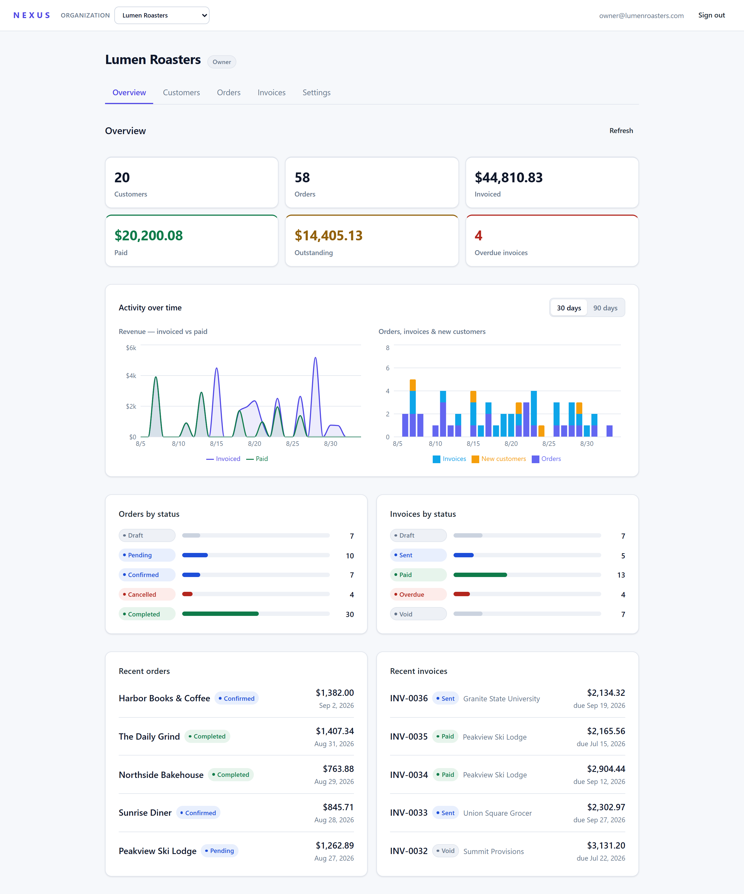
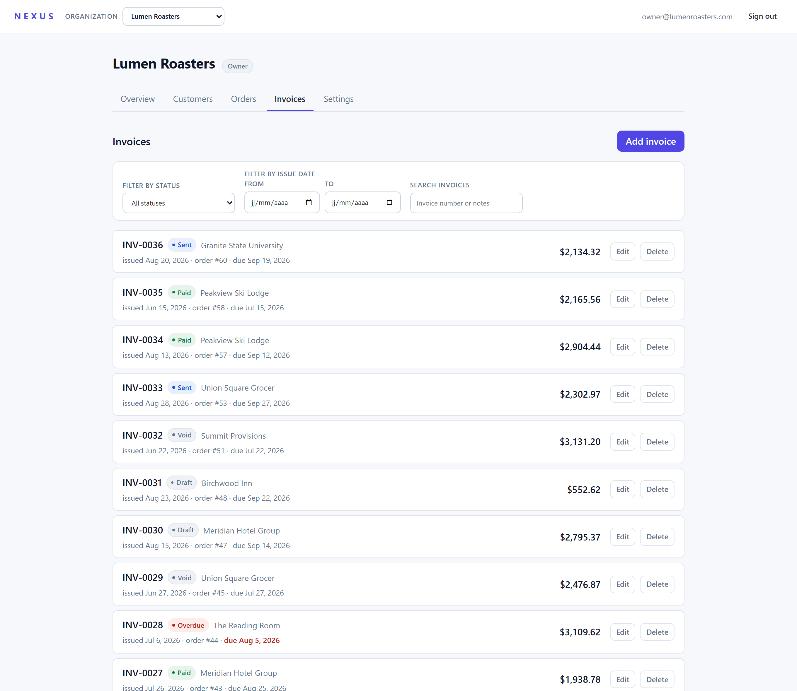
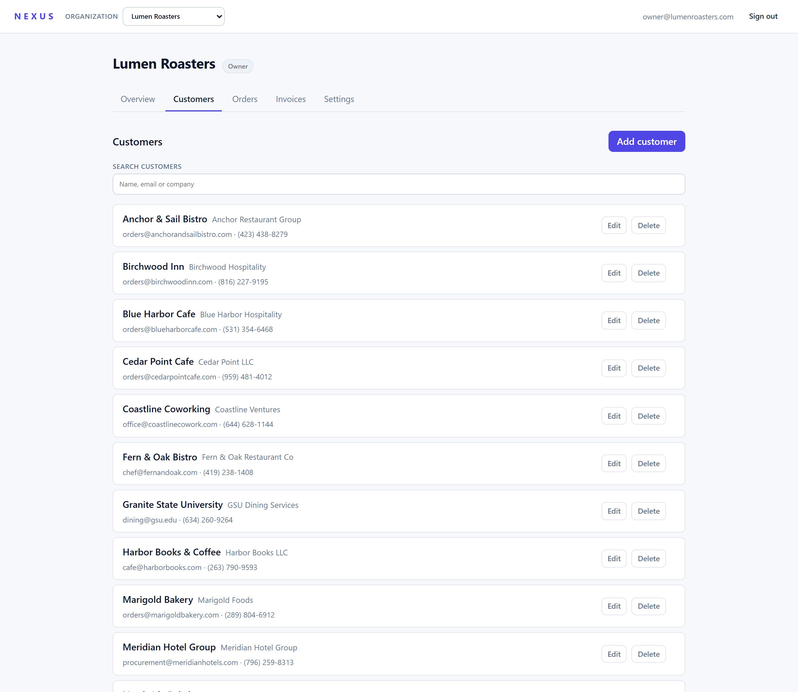
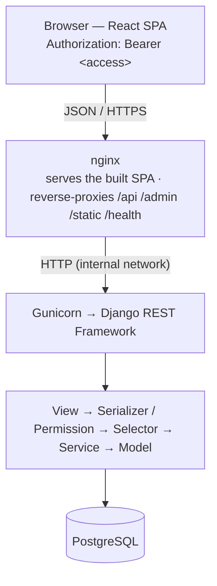

# NEXUS

**NEXUS is a multi-tenant business operations dashboard for managing company
information, customers, orders, invoices, and key business metrics in one
place.**

[](https://github.com/Ing-Makram/Nexus/actions/workflows/ci.yml)
&nbsp;[](./LICENSE)

It is a portfolio project built to production standards: a Django REST API, a
React single-page app, and a containerized deployment behind nginx — with a
strict layered backend, structural tenant isolation, and a full test and CI
pipeline.

---

## Overview

A user belongs to one or more **organizations** (the tenant boundary). Inside an
organization the workflow is:

```
Customers  →  Orders  →  Invoices  →  Overview
```

- **Customers** — the businesses an organization sells to.
- **Orders** — what a customer ordered, with a status and an amount.
- **Invoices** — the bill for an order (or a stand-alone invoice): auto-numbered,
  with an issue date, an optional due date, and a status.
- **Overview** — a read-only dashboard: counts, invoiced / paid / outstanding
  totals, overdue count, status distributions, 30/90-day activity charts, and
  recent activity.

Every organization's data is completely isolated from every other's.

---

## Screenshots

| Overview | Invoices | Customers |
| :--: | :--: | :--: |
| [](./docs/screenshots/overview.png) | [](./docs/screenshots/invoices.png) | [](./docs/screenshots/customers.png) |

---

## Features

- **Authentication** — email/password sign-up and login, JWT sessions with
  transparent access-token refresh, and a logout that blacklists the refresh
  token server-side.
- **Multi-organization tenancy** — a user can belong to several organizations
  and switch between them; each organization's customers, orders, invoices and
  dashboard are scoped to that organization only.
- **Role-based access control** — `owner` / `admin` / `member`. Any member can
  read; only owners and admins can create, update or delete. The owner is set at
  creation and is protected.
- **Customer management** — create / edit / delete, with name / company / contact
  details and client-side search.
- **Order management** — create / edit / delete, status (`draft` → `pending` →
  `confirmed` → `completed`, or `cancelled`), amount, notes; server-side status
  and date-range filtering.
- **Invoice management** — create / edit / delete, per-organization
  auto-numbering (`INV-0001`, `INV-0002`, …), issue / due dates, status
  (`draft` / `sent` / `paid` / `overdue` / `void`), optional link to an order,
  overdue highlighting, an `overdue` management command, and server-side
  status / date-range filtering.
- **Business overview** — a single aggregation endpoint for the headline figures
  plus a second endpoint for the daily time series behind the charts.
- **Organization settings** — rename, add / remove members, change member roles,
  and owner-only organization delete (which cascades to that organization's
  customers, orders and invoices).
- **Versioned REST API** under `/api/v1/` with per-resource contract docs.
- **Production deployment** — Docker Compose stack (PostgreSQL + Gunicorn +
  nginx), liveness / readiness probes, structured JSON logging with request-ID
  correlation, and an end-to-end smoke test.

---

## Architecture



**Backend** — one Django project, apps per domain
(`accounts`, `organizations`, `customers`, `orders`, `invoices`, `dashboard`,
`common`). Every app follows the same one-directional layering:

```
models → selectors → services → permissions → serializers → views
```

| Layer | Responsibility |
| :-- | :-- |
| **models** | schema, field validation, DB constraints and indexes |
| **selectors** | read paths — *the only place tenant scoping is expressed* (`*_for_user`) |
| **services** | write paths — atomic, invariant-enforcing; the only place data is mutated |
| **permissions** | reusable DRF permission classes ("may this actor do this?") |
| **serializers** | input parsing / field validation and output representation |
| **views** | thin HTTP glue — pick permissions, parse, call one selector/service, return |

**Frontend** — React + TypeScript + Vite, no router (a small auth /
organization gate hierarchy) and no UI framework. Each domain is a feature
module with the same shape: `api` (fetch wrappers), `context` + `Provider`
(state + server calls), a `use*` hook, and components. The frontend holds no
business logic — it consumes the REST API and owns only presentation and client
state.

**Tenant isolation is structural**: every organization-scoped query runs through
a `*_for_user(user)` selector, so a request for another organization's record
returns **404** — its existence is never disclosed.

See [`docs/adr/`](./docs/adr/) for the reasoning behind the modular monolith, the
layered architecture, the multi-tenancy model and the authentication design.

---

## Tech Stack

| Area | Technology |
| :-- | :-- |
| **Backend** | Python 3.12, Django 5, Django REST Framework, `djangorestframework-simplejwt`, `django-cors-headers` |
| **Database** | PostgreSQL 16 (SQLite for the test suite) |
| **Frontend** | React 19, TypeScript (strict), Vite; Recharts (lazy-loaded) for the dashboard charts |
| **Static files** | WhiteNoise (compressed, hashed manifest) |
| **App server / proxy** | Gunicorn + nginx |
| **Containers** | Docker, Docker Compose (separate dev and prod compose files) |
| **CI** | GitHub Actions |

The development `docker-compose.yml` also starts Redis and a Celery worker as
scaffolding for future background work; they run no application tasks today and
are absent from the production stack.

---

## Security

Implemented controls:

- **Password hashing** via Django's default PBKDF2 hasher; the password hash is
  never serialized.
- **JWT authentication** — 15-minute access tokens (held in memory), 1-day
  refresh tokens, a refresh-token blacklist, and server-side logout.
- **Password validation** on sign-up (length, common-password, numeric-only,
  similarity).
- **Structural tenant isolation** — see Architecture; cross-tenant reads and
  writes return 404, not 403.
- **Role-based authorization** enforced by reusable DRF permission classes, not
  ad-hoc view checks.
- **Serializer + database validation** — related fields (customer, order) are
  restricted to the caller's organization; uniqueness (organization membership,
  per-organization invoice numbers) is enforced by database constraints, and the
  registration path also handles the concurrent duplicate-email race as a 400.
- **Fail-fast production settings** — `config.settings.production` refuses to
  start without `SECRET_KEY` / `ALLOWED_HOSTS`; HSTS, secure cookies, SSL
  redirect, a proxy SSL header, `X-Frame-Options: DENY`,
  `X-Content-Type-Options: nosniff` and a `same-origin` referrer policy are set —
  Django applies them to the API, and nginx repeats them on the SPA responses it
  serves directly.
- **Non-root backend container** running under `tini`.
- **No secrets in the repository** — every setting comes from an environment
  variable listed with a placeholder in `.env.example`; `.env` is gitignored.

---

## Testing

| Suite | Count | Tooling |
| :-- | :-- | :-- |
| Backend | **~387 tests** | pytest + pytest-django — models, selectors, services, serializers, permissions, views; tenant isolation and RBAC are tested as explicit properties |
| Frontend | **93 tests** | Vitest + React Testing Library — user-visible behaviour: loading / empty / error states, role-aware UI, exact request parameters, organization-switch safety |
| Full stack | smoke test | `scripts/prod-smoke-test.sh` — builds the production images, boots the stack, checks `/health/` and `/health/ready/`, hits the API, verifies the readiness probe fails when the DB is down, then tears everything down |

All three run in CI on every push and pull request. Coverage percentages are not
tracked.

---

## Running Locally

**Prerequisites:** Docker + Docker Compose v2 (for the container path), or
Python 3.12 + Node 20 + PostgreSQL 16 (for the manual path).

```bash
cp .env.example .env      # then set SECRET_KEY and DB_PASSWORD to local values
```

### Docker (everything at once)

```bash
docker compose up -d      # PostgreSQL, Redis, Django (runserver), Vite, idle Celery worker
# API   → http://localhost:8000/api/v1
# App   → http://localhost:5173
```

### Manual

```bash
# backend
cd backend
python -m venv .venv && .venv/bin/pip install -r requirements.txt
.venv/bin/python manage.py migrate
.venv/bin/python manage.py runserver

# frontend (second terminal)
cd frontend
npm install
npm run dev
```

---

## Production / Deployment

The production stack is **PostgreSQL + Gunicorn/Django + nginx**, where nginx
serves the built React app and reverse-proxies the API. There is no dev server
and `DEBUG=False`.

```bash
docker compose -f docker-compose.prod.yml up -d --build
curl -fsS http://localhost:${PROXY_PORT:-8080}/health/        # liveness (no DB)
curl -fsS http://localhost:${PROXY_PORT:-8080}/health/ready/  # readiness (DB probe)
docker compose -f docker-compose.prod.yml down                # add -v to drop the volume
```

On backend container start: wait for the database → `migrate` → `collectstatic`
→ Gunicorn. Logs are structured JSON to stdout, carrying an `X-Request-ID` that
nginx generates or forwards.

The GitHub Actions pipeline runs backend quality checks, frontend quality
checks, `manage.py check --deploy`, a production image build, and the smoke
test. There is no deployment to a hosting provider — the stack is meant to be
run with `docker compose`.

Full procedure, rollback and log notes:
[`docs/runbooks/production-deployment.md`](./docs/runbooks/production-deployment.md).

---

## Project Structure

```
nexus/
├── backend/
│   ├── apps/            accounts · organizations · customers · orders · invoices · dashboard · common
│   ├── config/          settings (base/development/test/production), urls, wsgi/asgi, health
│   ├── Dockerfile       production image (Gunicorn, non-root)
│   └── tests/           cross-cutting: health, settings, request-id, logging, docker
├── frontend/
│   └── src/             feature modules (auth, organizations, customers, orders, invoices, dashboard),
│                        components, lib, api
├── infrastructure/      dev + prod Dockerfiles, nginx.prod.conf
├── docs/                adr/ · api/ · runbooks/ · schemas/ · screenshots/
├── scripts/             prod-smoke-test.sh
├── docker-compose.yml   ·  docker-compose.prod.yml
└── .github/workflows/   ci.yml
```

---

## Engineering Decisions

- **Selector / service split.** Reads go through named, parameterised queryset
  builders in `selectors.py`; writes go through `services.py`, which owns
  transactions and invariants. This keeps tenant scoping in exactly one place
  and makes business logic testable without HTTP.
- **Tenant isolation as a query primitive.** Rather than a permission check that
  can be forgotten, isolation is the `*_for_user` selector every query is built
  from. A cross-tenant request 404s before any business logic runs.
- **JWT with a short access token + refresh blacklist.** The access token lives
  only in memory for 15 minutes; the refresh token is persisted and can be
  revoked on logout, so a stolen refresh token has a bounded blast radius.
- **Organization / Membership model.** Tenancy and RBAC are one small model pair
  — `Organization` plus a `Membership` with a role and a
  `unique(organization, user)` constraint — instead of a separate roles/teams
  subsystem.
- **Modular monolith, not microservices.** One deployable, clean module
  boundaries, and an explicit ADR ([005](./docs/adr/005-future-microservices.md))
  on when extraction would be justified.
- **Docker production setup.** A multi-stage build produces a static SPA served
  by nginx and a non-root Gunicorn image; the entrypoint handles migrations and
  static collection so a deploy is a single `compose up`.

---

## Known Limitations

- **No pagination** — list endpoints return every record for the organization.
  Fine at portfolio-scale data; would need cursor pagination for large tenants.
- **No OpenAPI / Swagger UI** — the API is documented by hand in
  [`docs/api/`](./docs/api/).
- **No auth rate limiting / throttling** on login or registration.
- **No background jobs** — the `overdue` sweep is a management command, not a
  scheduled task. Redis / Celery are dev-only scaffolding.
- **No payment processing, PDF invoice generation, or email sending** — invoices
  are records, not documents that get delivered or paid through the app.
- **Basic observability** — structured logs and health probes, but no metrics or
  tracing backend (optional Sentry hook only).

---

## Future Improvements

- Cursor pagination + server-side search once list sizes justify it.
- A generated OpenAPI schema and a docs UI.
- Auth throttling and JWT refresh-token rotation.
- A first real background job (e.g. the overdue sweep on a schedule), which is
  when Celery would move from scaffold to production.

---

## License

[MIT](./LICENSE). Security policy: [SECURITY.md](./SECURITY.md). Contributor
guide: [CONTRIBUTING.md](./CONTRIBUTING.md).
