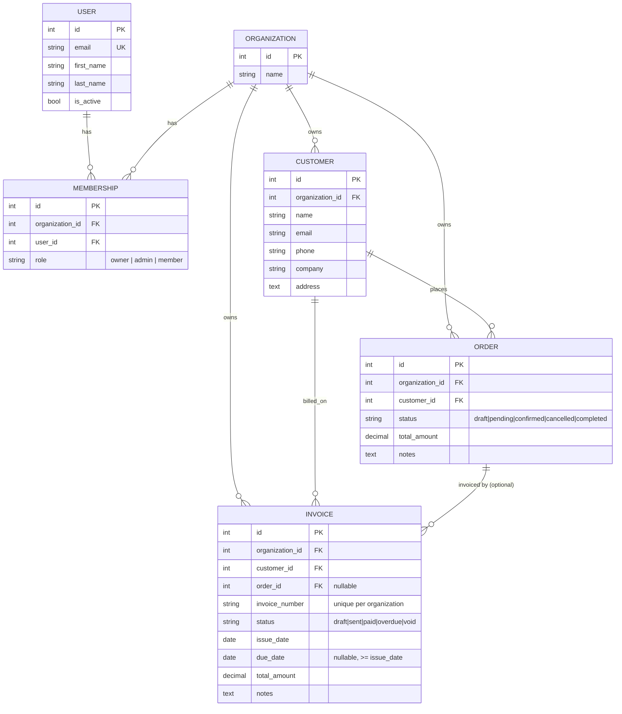

# Data Model

Every tenant-owned row carries an `organization` FK. Tenant scoping is enforced
in application code (the `*_for_user` selectors), not by the schema alone.

## Notes

| Relationship | On delete | Reason |
| :--- | :--- | :--- |
| `Membership.organization` / `Membership.user` | CASCADE | membership is meaningless without either side |
| `Customer.organization` / `Order.organization` / `Invoice.organization` | CASCADE | tenant ownership |
| `Order.customer` / `Invoice.customer` | PROTECT | keep transactional history; delete the customer's orders/invoices first |
| `Invoice.order` | SET NULL | an invoice outlives the order it was raised from |

- `(organization, invoice_number)` is unique; `invoice_number` is auto-assigned
  when blank.
- Check constraints: `total_amount >= 0`, status ∈ the model's choices,
  `due_date IS NULL OR due_date >= issue_date`, `name`/`invoice_number` non-empty.
- Org-first composite indexes on the list/filter paths
  (`(organization, -created_at)`, `(organization, status)`, `(organization, customer)`).
- Every model has `created_at` / `updated_at` (`TimestampedModel`); the
  business models also have `created_by` (`AuthoredModel`, `SET_NULL`).

See [ADR 003 — Multi-tenancy](../adr/003-multi-tenancy.md).
